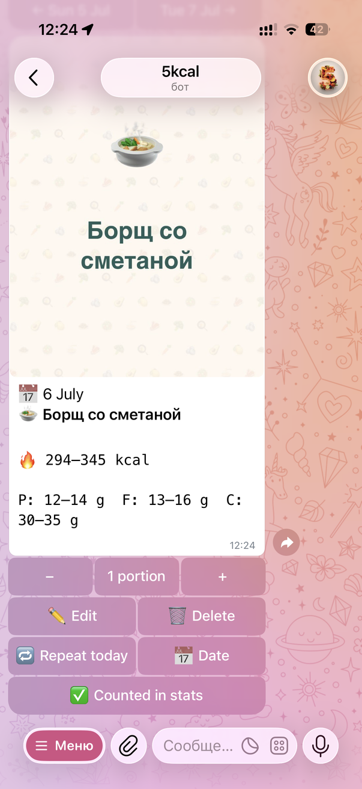
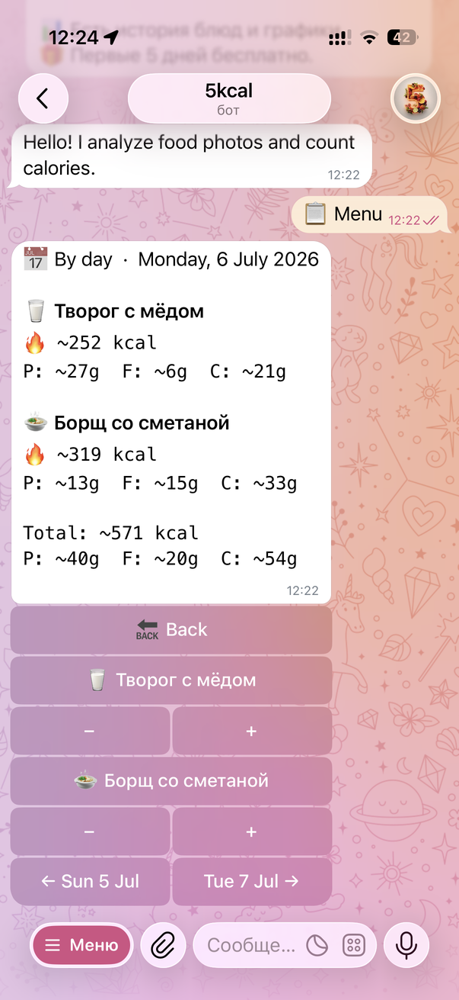
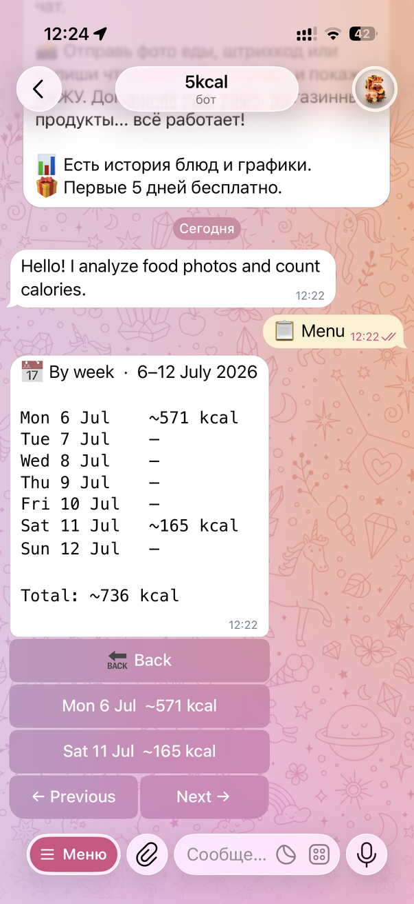
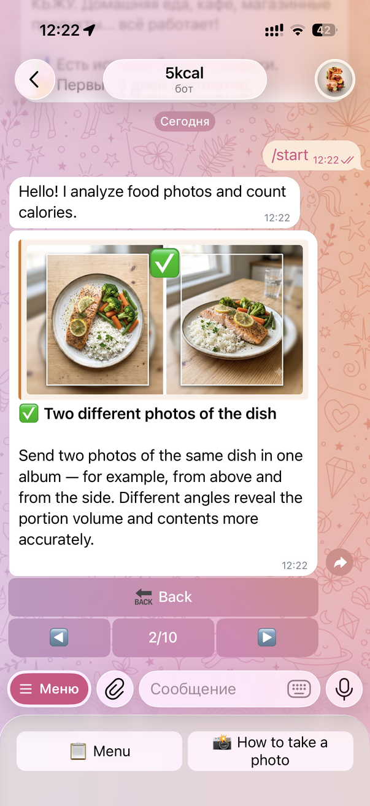

# 5 kcal — photo-based calorie tracker for Telegram

**5 kcal** is a production Telegram bot ([@fivekcal_bot](https://t.me/fivekcal_bot)) that estimates the calories and macros (protein / fat / carbs) of a meal from a photo. It is a solo project that I designed, built and operate end to end: LLM pipeline, backend, payments, infrastructure and monitoring.

> **This is a showcase snapshot, not a runnable copy of the product.**
> The production LLM prompts, the UI layer (screens, keyboards, handlers, localized texts) and the Mini App frontend are kept in a private repository. Everything else — the architecture, the LLM integration, data model, billing, observability and tests — is here as it runs in production.

## Screenshots

<table>
  <tr>
    <td align="center" width="25%"></td>
    <td align="center" width="25%"></td>
    <td align="center" width="25%"></td>
    <td align="center" width="25%"></td>
  </tr>
  <tr>
    <td align="center"><sub>Meal card: calorie and macro ranges, portions, edit / repeat / re-date</sub></td>
    <td align="center"><sub>Day view with per-meal portion controls</sub></td>
    <td align="center"><sub>Week overview with drill-down into days</sub></td>
    <td align="center"><sub>Onboarding: how to photograph a dish</sub></td>
  </tr>
</table>

## Highlights

- **Two-call vision pipeline.** Call 1 identifies the dish and decomposes it into components with per-100 g nutrition; Call 2 estimates the weight of each component volumetrically. Both calls use strict JSON schemas (`src/core/llm/two_call_models.py`) with typed `ok / error / clarification` outcomes, so the model can ask the user a clarifying question instead of guessing.
- **Provider-agnostic LLM layer.** One `LLMClient` protocol (`src/core/llm/protocol.py`) with OpenAI Responses API and Google Gemini implementations, per-scope reasoning effort, prompt caching, retries and token/cost accounting (`src/core/llm/usage.py`, `src/payment/costs.py`).
- **Accuracy work driven by an offline benchmark.** Prompt and model changes were accepted only after repeated runs on a labeled photo dataset (MAPE, bias, share of estimates within ±20 %). The benchmark harness and dataset are private; switching models and pipeline shape cut MAPE from ~39 % to ~24 %.
- **Per-user LLM spend limit.** A daily budget in Redis keyed by the user's local date, with a higher allowance on the first day so new users can try the product (`src/features/meals/spend_limit.py`).
- **Subscriptions and payments.** Robokassa card payments via a webhook with IP allowlist, signature and amount verification, and Redis `SETNX` idempotency so retried callbacks never double-activate a subscription (`src/payment/`, `src/features/subscription/`). Telegram Stars pricing is in `src/payment/costs.py`.
- **Barcode lookup chain.** Local decoding with zxing-cpp, then Open Food Facts → FatSecret → Dietagram → BarcodeLookup with caching and early exit on a good match (`src/features/barcode/`).
- **Telegram Mini App backend.** JSON API on the bot's aiohttp server, authorized by Telegram `initData` signature and freshness (`src/features/webapp/`).
- **Observability.** Prometheus metrics for business events and every LLM call (latency, tokens, cost, outcome), Grafana dashboards, Alertmanager rules routed to Telegram — error rates, stuck analyses, token spend spikes, payment signature failures, host resources (`src/core/metrics/`, `config/`).
- **Product analytics.** Funnel event tracking stored in PostgreSQL (`src/core/tracking/`).

## Ops bot (logbot)

Operations run through a second, private Telegram bot, so production can be watched and managed from a phone. One token (`ALERT_BOT_TOKEN`) and one admin chat serve four roles:

1. **Application alerts.** Every `WARNING`+ record from the app logger goes to the chat as a compact HTML message: level icon, `file:line`, escaped message, the last line of the traceback and the structured `extra` fields. Third-party library warnings are kept out of the chat; `error()`/`warning()` attach the active traceback automatically (`src/core/utils/logger.py`).
2. **Infrastructure alerts.** Alertmanager delivers Prometheus alerts to the same chat with firing/resolved messages, grouped by alert name. The token is injected into the config template at container start, so it never lands in the repo (`config/alertmanager/alertmanager.tpl.yml`, `docker-compose.yml`).
3. **Business events.** Sales (card or ⭐ Stars) and the first daily hit of a user's LLM spend limit are posted as service notifications. Sending is fire-and-forget: a failed notification is logged and never breaks the payment flow (`src/core/utils/admin_notify.py`).
4. **Admin console.** The bot polls its own commands, restricted to admin IDs at the router level, so every new command is protected by default. Destructive actions require inline confirmation. Polling restarts with exponential backoff independently of the main bot. Commands cover:
   - subscriptions — info, gift days, refund, grant/revoke unlimited;
   - users — Telegram profile lookup, reset the daily LLM limit, ban/unban;
   - payments — Robokassa test/prod mode, a 1⭐ self-test with auto-refund, global or per-admin payment kill switch, promo prices;
   - health — Redis/Postgres status and uptime.

   The admin command handlers belong to the private UI layer.

## Stack

Python 3.11 · aiogram 3 · OpenAI / Gemini · SQLAlchemy 2 + Alembic · PostgreSQL · Redis · Pillow · Docker Compose · nginx + certbot · Prometheus · Alertmanager · Grafana · pytest

## Layout

```
src/
├── core/
│   ├── llm/              LLM protocol, OpenAI and Gemini clients, schemas, usage/cost tracking
│   ├── database/         SQLAlchemy models, session-per-unit-of-work, CRUD
│   ├── image_processing/ in-memory resize pipeline in a ProcessPoolExecutor
│   ├── user_state/       Redis-backed sessions, navigation stack, state enums
│   ├── metrics/          Prometheus registry, middleware, HTTP server
│   ├── tracking/         funnel event tracking
│   └── utils/            logging, time zones, nutrition helpers
├── features/             feature services: meals, barcode, history, charts,
│                         subscription, onboarding, notifications, webapp API, user
└── payment/              Robokassa integration, webhook, LLM cost model
config/                   bot config, Prometheus, Alertmanager, Grafana, nginx, Redis
migrations/               Alembic migrations
tests/                    pytest integration tests (SQLite in-memory + fakeredis)
```

### Design notes

- **Layering.** Handlers (private) only talk to services; services own business decisions and never touch Telegram UI types. UI code receives ready dataclasses.
- **Transactions.** `Database.session()` is the only place that commits; CRUD helpers `flush()` but never commit, so several operations in one `with` block are atomic.
- **Images are never written to disk** — they are resized in memory and sent to the model; Telegram `file_id`s are stored instead.
- **i18n.** All user-facing strings are Fluent keys (`src/core/ui/texts/`); the `.ftl` catalogs are private.

## Tests

The tests that cover the published modules are included and run without external services:

```bash
pip install -r requirements.txt -r requirements-dev.txt
pytest
```

## License

© Andrey Krementsov. All rights reserved. The code is published for review purposes only; no license to use, copy or distribute it is granted.
